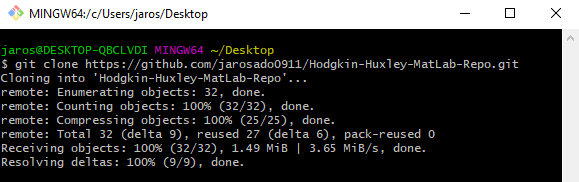
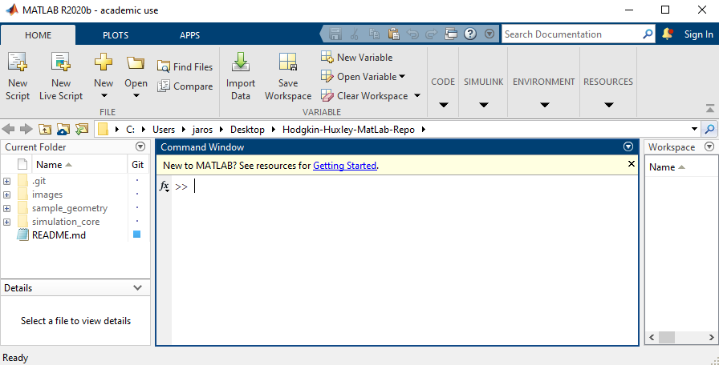

# Hodgkin-Huxley-MatLab-Repo
In this repo we endeavor to simulate Hodgkin-Huxley electrical dynamics on neurons.

## Software Requirements
* Most recent version of MatLab, [MatLab](https://www.mathworks.com/products/matlab.html)
* Recommended (for Windows Users): gitforwindows, [gitwindows](https://gitforwindows.org/)
* MacOS users using the bash is fine 

## Example Usage
The following steps have been tested on Windows 10 (will update when tested on Mac and Linux)
To run the code:
1. First open a  bash/terminal (whatever!) on your desktop (or wherever!) and
execute the following <code>git clone https://github.com/jarosado0911/Hodgkin-Huxley-MatLab-Repo.git</code> or you can download the ZIP of the repo. 
Below is a picture of what this may look like 

2. Next, open MatLab and navigate into the <code>Hodgkin-Huxley-MatLab-Repo</code>. It should look like this:

